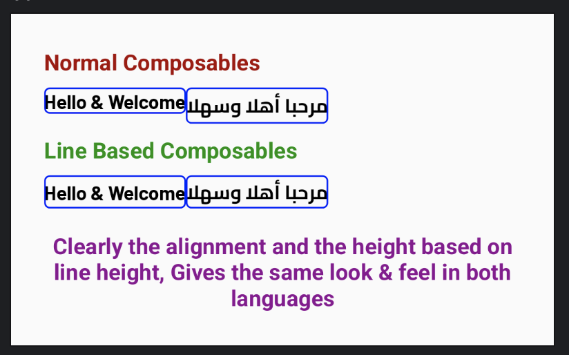

# Line Text

[](https://jitpack.io/#MohamedAlaaEldin636/Line-Text) [](https://android-arsenal.com/api?level=21) [](https://github.com/semantic-release/semantic-release)

- This is a text with the ability of controlling the height of the composable based
on the lines of the text and the line height and centering it perfectly as well, 
to overcome any font issue even if several fonts used, Check [Features](#features-) 
to understand more about the issue that's being solved isa.

# Contents [▴](#line-text)

- [Install](#install-)
    - [Jitpack Environment](#jitpack-environment-)
    - [Library](#library-)
- [Features](#features-)
    - [Solve Font Issues And Adapt Line Height](#solve-font-issues-and-adapt-line-height-)
- [Preview of the Solution](#preview-of-the-solution-)
- [Usage ( Code Examples )](#usage--code-examples--)
    - [Using **LineText**](#using-linetext-)
    - [Using **LineBasicTextField**](#using-linebasictextfield-)
    - [Using **LineTextField**](#using-linetextfield-)
    - [Using **LineOutlinedTextField**](#using-lineoutlinedtextfield-)
- [Issues & Contributions](#issues--contributions-)
- [License](#license-)

## Install [▴](#contents-)

- [Jitpack Environment](#jitpack-environment-)
- [Library](#library-)

### Jitpack Environment [▴](#install-)

- In your `settings.gradle` File file add below code

``` kotlin
// Note this is in Kotlin DSL Not Groovy.
dependencyResolutionManagement {
    //...
    repositories {
        //...
        maven("https://jitpack.io")
    }
    //...
}
```

- **OR** if you depend on **Top-level** gradle file, then add below code in it

``` kotlin
// Note this is in Kotlin DSL Not Groovy.
allprojects {
    repositories {
        maven { url = uri("https://jitpack.io") }
    }
}
```

### Library [▴](#install-)

- X.Y.Z denotes library version which is [](https://jitpack.io/#MohamedAlaaEldin636/Line-Text)

- In your Gradle **Module-level** file add below code

``` kotlin 
plugins {
    kotlin("android")
    // ...
}
// ...
dependencies {
    implementation("com.github.MohamedAlaaEldin636:Line-Text:X.Y.Z")
    // ...
}
```

## Features [▴](#contents-)

- [Solve Font Issues And Adapt Line Height](#solve-font-issues-and-adapt-line-height-)

### Solve Font Issues And Adapt Line Height [▴](#features-)

#### Issue

- in any App that supports multiple languages you may encounter using 2 or more fonts
1 for each language especially if using RTL with LTR as in case of Arabic and English,
**Which** will make the height of the `Text`, `BasicTextField` & `TextField` changes
when you toggle the language due to Font changes (not always but can easily happen),
and this won't be accepted by the designer as normally they make the component uses
same height in any Locale as per Figma design or any design.

#### Solution

- This library enables you to decide the height of the composable and it centers
the text perfectly within it, so it remains the same in all the fonts given,
by just using `LineText` instead of `Text` & `LineBasicTextField` instead of `BasicTextField` &
`LineTextField` instead of `TextField`.

- Note, shouldn't be used if you don't care about the height as `Text` by 
default wraps height.

## Preview of the Solution [▴](#contents-)



## Usage ( Code Examples ) [▴](#contents-)

- [Using **LineText**](#using-linetext-)
- [Using **LineBasicTextField**](#using-linebasictextfield-)
- [Using **LineTextField**](#using-linetextfield-)
- [Using **LineOutlinedTextField**](#using-lineoutlinedtextfield-)

### Using `LineText` [▴](#usage--code-examples--)

```kotlin
// Use it like you would use any `Text` composable

// 1st you can depend on line height in style.
LineText(
    text = "Hello Line Text !",
    style = TextStyle(
        // try 20, 50, etc...
        // Note that 30 is used as 30.dp for the lineHeight
        // and since lines of text is 1 then height of this composable 
        // results in (1 * 30.dp) equals 30.dp
        lineHeight = 30.sp
    ),
)

// 2nd you want to enforce specific height
LineText(
    text = "Hello Line Text !",
    // below ignores value in the style and use below 1 instead isa.
    exactLineHeight = { 20.dp },
)
```

### Using `LineBasicTextField` [▴](#usage--code-examples--)

```kotlin
// Use it like you would use any `Text` composable

// 1st you can depend on line height in style.
LineBasicTextField(
    value = "Hello Line Text !",
    onValueChange = {},
    // below ignores value in the style and use below 1 instead isa.
    // If wanna use the value in style check above LineText example isa.
    lineHeight = { 20.dp },
)
```

### Using `LineTextField` [▴](#usage--code-examples--)

```kotlin
// Use it like you would use any `Text` composable

// 1st you can depend on line height in style.
LineTextField(
    value = "Hello Line Text !",
    onValueChange = {},
    // below ignores value in the style and use below 1 instead isa.
    // If wanna use the value in style check above LineText example isa.
    lineHeight = { 20.dp },
)
```

### Using `LineOutlinedTextField` [▴](#usage--code-examples--)

```kotlin
// Use it like you would use any `Text` composable

// 1st you can depend on line height in style.
LineOutlinedTextField(
    value = "Hello Line Text !",
    onValueChange = {},
    // below ignores value in the style and use below 1 instead isa.
    // If wanna use the value in style check above LineText example isa.
    lineHeight = { 20.dp },
)
```

## Issues & Contributions [▴](#contents-)

- If you want to add a contribution or request a feature/improvement or file a bug feel free 
to do so via PR or a question.

## [License](https://github.com/MohamedAlaaEldin636/Line-Text/blob/master/LICENSE) [▴](#contents-)

```
Copyright © 2020 Mohamed Alaa

Licensed under the Apache License, Version 2.0 (the "License");
you may not use this file except in compliance with the License.
You may obtain a copy of the License at

    http://www.apache.org/licenses/LICENSE-2.0

Unless required by applicable law or agreed to in writing,
software distributed under the License is distributed on an "AS IS" BASIS,
WITHOUT WARRANTIES OR CONDITIONS OF ANY KIND, either express or implied.
See the License for the specific language governing permissions and limitations under the License.
```

| Permissions         | Limitations           | Conditions   |
| ------------------- | --------------------- | ----------- |
| :heavy_check_mark: Commercial Use | :x: Trademark use | :information_source: License and copyright notice |
| :heavy_check_mark: Modification | :x: Liability | :information_source: State changes |
| :heavy_check_mark: Distribution | :x: Warranty | - |
| :heavy_check_mark: Patent use | - | - |
| :heavy_check_mark: Private use | - | - |
